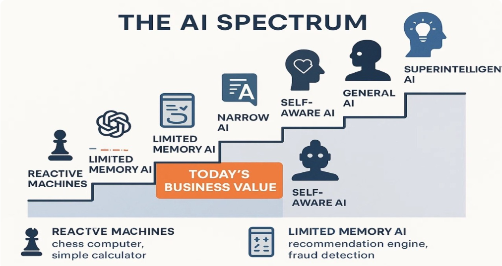

# Chapter 1: Foundations of AI

## Introduction

Welcome to the first chapter of your AI & Machine Learning journey. In this chapter, we'll lay the groundwork for understanding what Artificial Intelligence really means, explore its relationship with Machine Learning, and examine the historical context that led to today's AI revolution.

## Chapter Overview

### Learning Objectives
By the end of this chapter, you'll be able to:
- Clearly distinguish between AI, Machine Learning, and Deep Learning
- Understand the historical milestones that shaped modern AI
- Identify the fundamental principles that govern AI systems
- Set up a proper development environment for AI experiments

### Chapter Structure

**📚 Pages in this Chapter:**
1. **What is AI** - Defining artificial intelligence beyond the buzzwords
2. **ML vs AI** - Understanding the relationship between AI and its subfield of ML
3. **History of AI** - Tracing the evolution from Alan Turing to modern LLMs
4. **Principles** - Core mathematical and logical foundations
5. **Lab Setup** - Preparing your environment for hands-on experiments

## What is Artificial Intelligence?

Artificial Intelligence (AI) is one of the most transformative technologies of our time, but what exactly does it mean?

### Defining AI

At its core, **Artificial Intelligence** refers to the ability of machines to perform tasks that typically require human intelligence. This includes:

- **Learning** from experience
- **Reasoning** about problems
- **Understanding** natural language
- **Perceiving** the world through sensors
- **Making decisions** under uncertainty

### Types of AI

AI can be categorized in several ways:

---
#### Code Example: Simple AI‑type Checker (Python)
```python
def is_narrow_ai(task: str) -> bool:
    """Return True if the task is typical of Narrow AI (ANI)."""
    narrow_tasks = {
        "image classification",
        "speech recognition",
        "recommendation",
        "chess engine",
    }
    return task.lower() in narrow_tasks

# Example usage
print(is_narrow_ai("image classification"))  # True
print(is_narrow_ai("general problem solving"))  # False
```

---

#### Diagram: AI Capability Spectrum


---
#### Table: AI Types by Capability & Functionality
| Capability | Examples | Typical Use‑Case |
|-----------|----------|-----------------|
| **Narrow AI (ANI)** | Voice assistants, recommendation systems | Perform a single, well‑defined task |
| **General AI (AGI)** | Theoretical systems with human‑level reasoning | Solve any intellectual problem |
| **Superintelligent AI (ASI)** | Hypothetical future systems | Surpass human intelligence in all domains |


#### By Capability

1. **Narrow AI (ANI)** - Also called Weak AI
   - Designed to perform a specific task
   - Examples: Chess engines, voice assistants, recommendation systems
   - **Current state**: All AI systems today are Narrow AI

2. **General AI (AGI)** - Also called Strong AI
   - Can understand, learn, and apply intelligence to any problem
   - Possesses human-like cognitive abilities
   - **Current state**: Still theoretical, active research area

3. **Superintelligent AI (ASI)**
   - Surpasses human intelligence in all aspects
   - Theoretical concept with significant philosophical implications
   - **Current state**: Subject of speculation and debate

#### By Functionality

1. **Reactive Machines**
   - No memory, no learning
   - Responds to current inputs only
   - Example: IBM's Deep Blue chess computer

2. **Limited Memory**
   - Can use recent past experiences
   - Uses historical data for decision-making
   - Example: Self-driving cars

3. **Theory of Mind**
   - Understands emotions, beliefs, and intentions
   - Can predict behavior
   - **Current state**: Active research area

4. **Self-Awareness**
   - Conscious, sentient AI
   - **Current state**: Purely theoretical

### AI in Everyday Life

You're already interacting with AI daily:

- **Smartphones**: Face recognition, predictive text, voice assistants
- **Social Media**: Content recommendation, image tagging
- **E-commerce**: Product recommendations, fraud detection
- **Transportation**: GPS optimization, ride-sharing algorithms
- **Healthcare**: Medical imaging analysis, drug discovery
- **Finance**: Algorithmic trading, credit scoring

### Why AI Matters Now

Several factors have converged to create the current AI boom:

1. **Computational Power**: GPUs and specialized AI chips
2. **Big Data**: Massive datasets for training
3. **Algorithmic Advances**: New techniques like deep learning
4. **Cloud Computing**: Accessible AI infrastructure
5. **Open Source**: Shared tools and frameworks

## Interactive Exploration

### Thought Experiment: AI Capabilities

Let's test your understanding of AI capabilities:

<details>
<summary>🤔 Question: Which of these tasks require AI?</summary>

Consider these tasks:
- Playing chess at grandmaster level
- Recognizing faces in photos
- Solving a math equation
- Driving a car
- Having a conversation
- Sorting emails by importance

**Answer**: All except "solving a math equation" (which can be done with traditional programming)

</details>

### Real-World AI Examples

<details>
<summary>🔍 Deep Dive: Famous AI Systems</summary>

**IBM Watson**
- Domain: Natural Language Processing and Question Answering
- Achievement: Won Jeopardy! in 2011
- Impact: Demonstrated AI's ability to understand complex human language

**DeepMind's AlphaGo**
- Domain: Strategic Game Playing
- Achievement: Defeated world champion Go player in 2016
- Impact: Go has more possible moves than atoms in the universe!

**GPT Models**
- Domain: Natural Language Generation
- Achievement: Human-like text generation and understanding
- Impact: Revolutionized AI's ability to work with language

</details>

## Next Steps

Ready to dive deeper? Let's explore what makes AI different from traditional programming and understand the fundamental principles that make it possible.

### Key Takeaways

- AI is about creating intelligent behavior in machines
- Current AI is specialized (Narrow AI), not general-purpose
- AI is already deeply integrated into modern life
- The field is advancing rapidly due to multiple converging factors

### Preparation for the Next Section

Before moving on, think about:
- What aspects of AI interest you most?
- How do you think AI differs from traditional programming?
- What applications of AI excite or concern you?

---

**💡 Quick Check**: Can you name three examples of AI you interact with daily? How do they demonstrate "intelligence"?

---

## Chapter Progress

You've completed: 📖 Introduction
Next up: [What is AI](./what-is-ai) →