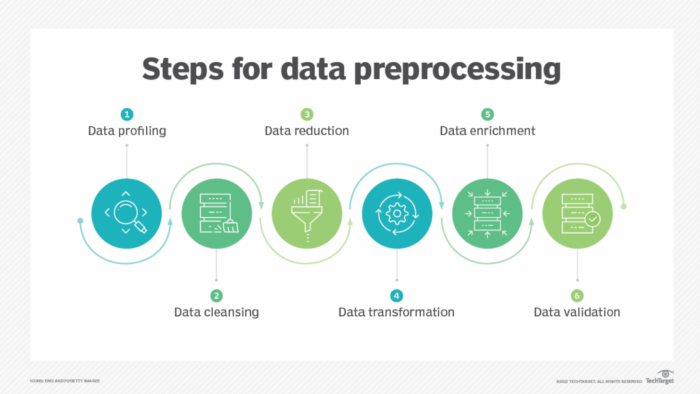

# Chapter 2: Data Preprocessing

## Introduction

Data preprocessing is the foundation of any successful machine learning project. As the saying goes, "garbage in, garbage out" - the quality of your data directly determines the quality of your model's predictions. This chapter teaches you how to transform raw, messy data into clean, well-structured datasets ready for machine learning algorithms.

## Chapter Overview

### Learning Objectives
After completing this chapter, you will:
- Master various data cleaning techniques
- Understand feature engineering strategies
- Know when and how to normalize data appropriately
- Handle missing data systematically
- Apply preprocessing in real-world scenarios

### Core Topics
**📊 Key Areas Covered:**
1. **Data Cleaning** - Removing noise, duplicates, and inconsistencies
2. **Feature Engineering** - Creating meaningful features from raw data
3. **Data Normalization** - Scaling techniques for different algorithms
4. **Handling Missing Data** - Strategic approaches for incomplete datasets
5. **Practical Exercise** - Build a complete preprocessing pipeline

## Real-World Context

Modern datasets are increasingly complex, with data coming from:
- Social media sources with varying quality
- Sensor data with measurement errors
- Survey responses with missing fields
- Financial data with outliers and anomalies

## Visualization Focus

---
#### Code Example: Simple Data Cleaning (Python, pandas)
```python
import pandas as pd

# Sample raw data
raw = pd.DataFrame({
    "age": [25, None, 30, 22, "?"],
    "salary": [50000, 60000, None, 45000, 52000],
})

# Clean numeric columns: convert to numeric, coerce errors, fill missing values
clean = raw.apply(pd.to_numeric, errors="coerce")
clean = clean.fillna(clean.mean())

print("Cleaned Data:")
print(clean)
```
---
#### Diagram: Data Preprocessing Pipeline

---
#### Table: Common Preprocessing Techniques
| Technique | Purpose | Typical Tools |
|-----------|---------|---------------|
| Missing‑value imputation | Fill gaps in data | pandas, sklearn.impute |
| Normalization | Scale features to a common range | sklearn.preprocessing |
| Encoding categorical variables | Convert categories to numbers | pandas.get_dummies |
```

Throughout this chapter, visual elements help you understand:
- **Before/After** comparisons of cleaned vs. raw data
- **Interactive charts** showing the impact of different preprocessing choices
- **Progressive visualization** as you apply each technique

## Hands-On Approach

Each section includes:
- **Code snippets** ready to run in embedded notebooks
- **Interactive widgets** to adjust preprocessing parameters
- **Immediate feedback** on how changes affect your data

## Assessment & Tracking

Measure your understanding through:
- **Algorithm-specific recommendations** for preprocessing
- **Interactive quizzes** covering edge cases
- **Performance metrics** comparing preprocessed vs. raw data results

Ready to turn messy data into machine learning gold? Let's start with data cleaning!