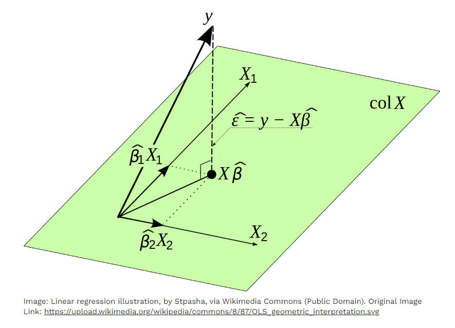

# Chapter 3: Supervised Learning

## Introduction

Supervised learning is the cornerstone of modern machine learning, powering everything from email spam filters to medical diagnosis systems. This chapter dives deep into algorithms that learn from labeled examples, enabling you to build models that can make accurate predictions on new, unseen data.

## Chapter Overview

### Learning Objectives
Through hands-on exploration, you'll:
- Master linear and logistic regression fundamentals
- Understand decision trees and their interpretability
- Implement random forests for robust predictions
- Evaluate model performance using appropriate metrics
- Build end-to-end supervised learning projects

### Core Algorithms
**🤖 Algorithms Covered:**
1. **Linear Regression** - Predict continuous outcomes with linear models
2. **Logistic Regression** - Binary and multiclass classification
3. **Decision Trees** - Interpretable tree-based decision making
4. **Random Forests** - Ensemble methods for improved accuracy
5. **Model Evaluation** - Rigorous assessment techniques
6. **Hands-On Project** - Comprehensive supervised learning workflow

## Practical Applications

Real scenarios we'll explore:
- **House price prediction** using linear regression
- **Email spam detection** with logistic regression
- **Medical diagnosis** through decision trees
- **Recommendation systems** via random forests

## Interactive Components

---
#### Code Example: Linear Regression from Scratch (Python)
```python
import numpy as np

# Simple dataset
def generate_data(n=20):
    X = np.linspace(0, 10, n)
    noise = np.random.normal(0, 1, n)
    y = 2.5 * X + 4 + noise
    return X, y

X, y = generate_data()

# Closed‑form solution for linear regression
X_b = np.c_[np.ones((len(X), 1)), X]  # add bias term
theta_best = np.linalg.inv(X_b.T @ X_b) @ X_b.T @ y

print("Intercept", theta_best[0])
print("Slope", theta_best[1])
```

---
#### Diagram: Linear Regression Geometry

---
#### Table: Regression Evaluation Metrics
| Metric | Description | Typical Use |
|--------|-------------|-------------|
| MSE (Mean Squared Error) | Average squared difference between predicted and actual values | Regression performance |
| RMSE (Root MSE) | Square root of MSE for interpretability in original units | Regression performance |
| R² (Coefficient of Determination) | Proportion of variance explained by the model | Model goodness‑of‑fit |
```

**🎯 Interactive Elements:**
- **Parameter tuning playgrounds** - Adjust hyperparameters and see real-time changes
- **Feature selection tools** - Discover which features matter most
- **Model comparison dashboards** - Side-by-side algorithm comparisons
- **Performance visualization** - ROC curves, confusion matrices, and more

## Mathematical Foundations

**📈 Math Made Clear:**
- Derivations explained with interactive visualizations
- Gradient descent implementations you can step through
- Regularization concepts visualized with animations
- Loss functions made intuitive with comparative examples

## Advanced Topics

**🚀 Beyond Basics:**
- **Feature engineering strategies** specific to each algorithm
- **Cross-validation techniques** for robust model selection
- **Ensemble methods** combining multiple weak learners
- **Hyperparameter optimization** using grid and random search

## Assessment Structure

**✅ Progress Tracking:**
- **Algorithm-specific challenges** designed for each technique
- **Real-world datasets** to cement understanding
- **Performance targets** to measure mastery
- **Code reviews** with AI-powered suggestions

Ready to predict the future with data? Let's start with linear regression!